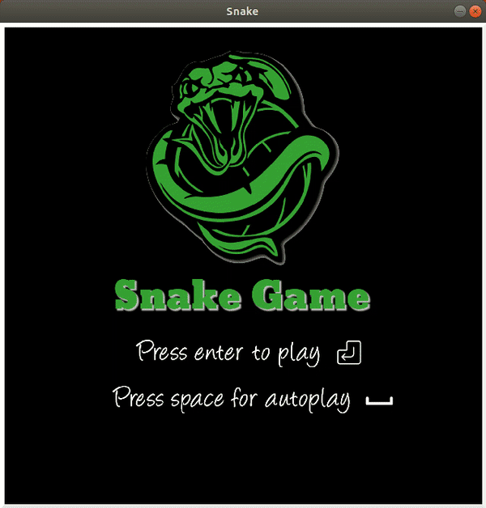

# Reinforcement Learning Snake Game

-----
## Table of contents
* [Introduction](#introduction)
* [General info](#general-info)
* [Results](#results)
* [Launch](#launch)

----
## Introduction
This game was made to get a better understanding of Markov Decision Processes and solving them using Dynamic Programming.

----
## General Info
We have to modes of playing:
- Normal mode, where you control the snake using the up, down, left and right keys.
- Autoplay mode, where a Reinforcement Learning Agent made by formulating a Markov Decision Process of the environment and obtainig the value state function and best actions using Dynamic Programming.

There are four files:
* [main.py](main.py), the main file used to run the game.
* [app.py](app.py), the file which includes the application itself, It creates the snake and Reinforcment learning agent objects, runs them and also renders the game and plays sound effects.
* [snake.py](snake.py), includes the snake class.
* [reinforcement_learning_agent.py], includes the Reinforcement Learning Dyanmic Programming Agent.

----
## Results

In autoplay mode the agent may lose after about a score of 45 on average in a 16x16 grid.

----
## Launch
Simply clone the repo and run main.py
